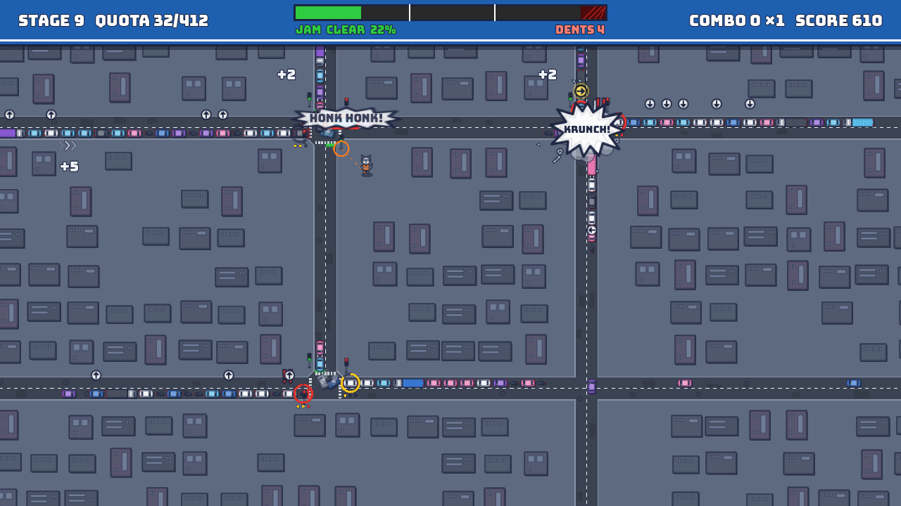

# Fender Bandit

**Stop. Go. Oops.** A raccoon has gotten its paws on the city's traffic lights. Flip lights, keep the cars moving,
tow away the wreckage, and hold off gridlock for as long as you can.

**Play it on itch.io: https://kittypounce.itch.io/fender-bandit** (in the browser, or download for Windows). Submitted to the jam.

A solo entry for the [2026 HCSS Game Jam](https://itch.io/jam/2026-hcss-game-jam), on the themes *Raccoons* and
*Accidents happen!* Built in Godot 4.7 with GDScript. All art, audio and code were produced with AI tools, directed
by the developer.

## Controls

Keyboard or gamepad (arcade-cabinet friendly), no mouse.

| Action | Keyboard | Gamepad |
|---|---|---|
| Move | WASD / arrow keys | D-pad |
| Toggle a traffic light | J | A |
| Dash | Space | X |
| Tow wreckage | L | Y |
| Pause | Esc, P or Enter | Start |

## Development

The Godot project is in `game/`; open `game/project.godot` in Godot 4.7.2. From the repo root in Git Bash:

| Task | Command |
|---|---|
| Run the tests | `game/tools/test.sh` |
| Run the headless smoke test | `game/tools/smoke.sh` |
| Export the Web and Windows builds | `game/tools/export.sh` |
| Serve the web build at http://localhost:8060 | `node game/tools/serve_web.mjs` |
| Publish to itch.io | `game/tools/publish.sh` (see [docs/publishing.md](docs/publishing.md)) |

- [CONTEXT.md](CONTEXT.md): the domain language (Raccoon, Light, Switch, Jam, Gridlock, ...)
- [docs/adr/](docs/adr/): architecture decisions
- [docs/tuning.md](docs/tuning.md): every gameplay tuning knob
- [CLAUDE.md](CLAUDE.md): the full command list and working notes

Submitted games and their assets become HCSS IP under the jam rules.
