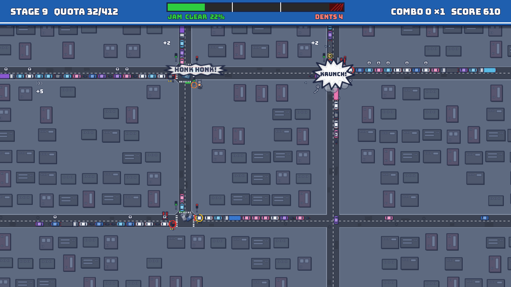
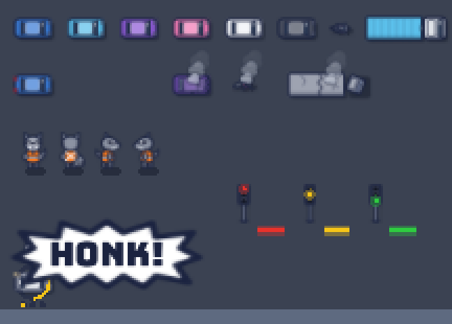

# Sprite register

The game's look: the fixed rules every sprite obeys (the **style sheet**) and one entry per sprite (the **sprite list**). AI tools take this file as context, so every asset comes out consistent with the others. Decided in [#6](https://github.com/klusignolo/Fender-Bandit/issues/6); background research in `docs/research/sprite-pipeline.md` on the [`research/sprite-pipeline`](https://github.com/klusignolo/Fender-Bandit/tree/research/sprite-pipeline) branch.

Like `docs/tuning.md`, this is a living register: when a proof or playtest changes a rule or a sprite, update its entry and add a note. Sizes that are gameplay (vehicle footprints) also live in `docs/tuning.md`.

**Legible at 0.45× ([#18](https://github.com/klusignolo/Fender-Bandit/issues/18)); charm at 1× awaits the dev.** The sprite proof shot every sprite at 1× and 0.45×, with and without mipmaps ([Proof](#proof)). The baked outline, the mipmaps, the SVG Raccoon and the palette all stay. The dev's verdict on the 1× look can still overrule the Raccoon and the palette.

## Style sheet

### Projection and resolution

- **Top-down world, ¾-view characters.** Roads, vehicles, decals and rooftops are seen straight down. The Raccoon and Light poles are drawn in ¾ view (Zelda/Stardew style).
- **Base resolution 1280×720,** Godot `canvas_items` stretch, aspect expand. The cabinet resolution is unknown; the base only sets coordinate units.
- **Author every texture at 2×** the world size listed here, import with mipmaps on and a Linear Mipmap filter (the camera zooms out to ~0.45×).
- **Units:** all sizes in this file are world px at 1× unless marked "@2×".

### Medium

- **Flat vector SVG,** written by Claude. No pixel art (it shimmers under zoom and rotation).
- **Fallback, not taken (#18):** Claude-scripted Blender renders of the Raccoon alone (Workbench, flipped-shell outline). At 0.45× the Raccoon (28 × 38 world px) is 13 × 17 on-screen px whatever the medium, and its orange vest is what reads, so renders would add nothing there. It stays an option if the dev finds the 1× Raccoon lacks charm.

### Outline and shadow

- **Outline:** 2 world px (4 px @2×), baked into each SVG, in ink navy. Every silhouette gets it; interior lines are 1 world px. At 0.45× it is under 1 on-screen px but still reads as a dark rim, so the constant-screen-width outline shader (the fallback) was not needed (#18).
- **Light:** one light, from the top-left.
- **Shadow:** each upright or vehicle sprite has a separate shadow sprite: its silhouette in shadow colour, offset 3 world px down-right, on a shadow layer under everything upright. It does not rotate with the vehicle, so the light stays consistent through turns.
- **Interior shading:** at most one flat shade tone per colour (the side away from the light). No gradients.

### Palette

Saturated red, yellow and green are **reserved for game signals** (Lights, stop lines, Patience, Blowing the red, Jam-levels, GRIDLOCK). Orange is **reserved for the Raccoon** (its vest and Raccoon UI moments). Nothing else may use them.

| Token | Hex (starting point) | Use |
|---|---|---|
| `ink` | `#1B2340` | Outlines, UI text shadow |
| `shadow` | `#0E1424` at 45% | Shadow sprites |
| `signal_red` | `#E8322B` | Red Light, red stop line, GRIDLOCK, Heavy Jam, last Patience pip |
| `signal_yellow` | `#F5C518` | Yellow Light, Busy Jam, first Patience pips |
| `signal_green` | `#2ECC40` | Green Light, Clear Jam |
| `raccoon_orange` | `#FF7A1A` | The vest; construction stripes in UI |
| `blinker` | `#FFE3A3` | Blinkers only: pale amber, tiny, flashing |
| `brake` | `#C4242B` | Brake lights only: tiny, at the rear |
| Car bodies | blue `#3A7BD5`, sky `#5BC0EB`, purple `#8E5BD6`, pink `#F27BB5`, white `#EEF1F6`, charcoal `#4A5060` | The 6 safe body tints |
| `asphalt` | `#3B4252` | Road surface, worn with darker tar patches |
| `pavement` | `#5E6A80` | City blocks, kerbs |
| Rooftops | cool blues, slates, muted purples | Block scatter. **No trees** (green is reserved) |
| `sign_blue` | `#1F5FAF` | UI sign panels |

The proof (#18) kept every hex value: at 0.45× the six tints stay distinct from each other and from `asphalt`. Charcoal is the weakest; it reads by its outline and pale glass. Tune them in a playtest if needed, keeping the reservation rule.

### Type and UI

- **Font: Bungee** (OFL), for every word in the game: UI, Crash burst words, Honks, BONK!, tags. It's all capitals, so lower-case strings show as capitals.
- **Panels:** blue road signs: rounded corners, ink edge, white inset rule, white text, a shadow down-right. Drawn in code as StyleBoxFlats (`Sign.panel`), not a 9-patch SVG: a 9-patch texture blurs when the window stretches the 1280×720 base, and a StyleBoxFlat stays crisp (#42).
- **Raccoon moments** (the "NEW: …" badge, the name/logo lockup) use orange-and-navy construction stripes.
- **GRIDLOCK banner** is the one full-red UI element.
- **HUD:** a slim sign strip along the top: score, Combo, the Jam meter (filled in Jam-level colours) and stage/Quota.

### Anchors and draw order

- **Anchor at the ground contact:** the Raccoon's feet, the pole's base, a vehicle's centre.
- **Layers, bottom to top:** ground and blocks → road → road decals → shadows → vehicles → upright sprites (Raccoon, poles; **Y-sorted**) → floating cues → Crash bursts → HUD.
- **Floating cues are upright and never rotate** with their vehicle.

### Scale ladder

| Sprite | Footprint (world px) | Notes |
|---|---|---|
| Lane / road | 30 / 60 | One lane each way |
| Car | 38 × 20 | |
| Motorcycle | 22 × 10 | Rider's helmet in a safe bright tint |
| Semi | 84 × 24 | Cab 24 + trailer 60, **one rigid sprite** |
| Raccoon | 28 wide; sprite ~28 × 38 | Taller than its footprint in ¾ view |
| Light pole | 14 × 42 | Head overhangs the kerb. Grown from ~10 × 34 in #39 so the lit lamp is 5 world px across |

## Sprite list

Canvas sizes are @2× and include the outline margin. "Tint" means a white layer tinted in Godot. Animations marked *cutout* are part motion in Godot, posed from code each tick (`RaccoonRig.pose_of`, #41), not drawn frames.

### Raccoon

Cutout rig: head, body with vest, tail, 2 arms, 2 legs, drawn for **3 facings: front (moving down), back (moving up), side (mirrored for left)**. Diagonal movement shows the side view. Facing always follows the joystick.

**The rig (#41):** `RaccoonRig` (`game/raccoon/raccoon_rig.gd`). Every part of every view is drawn on the first pass's shared 64 × 84 canvas with the feet at (32, 80), so at rest the parts land exactly where the whole sprite (#39) had them. Each part turns about its own pivot. `RaccoonRig.pose_of` is a pure function: given a view, an animation and how far into it, it returns how each part turns and lifts, and how the whole body moves about its feet. The Raccoon picks the animation each tick, the first that applies of Bonk, Dash, Switch, Tow, Walk and Idle. Each view has its own part files, even where they match (the back's legs and arms copy the front's), so one view can be redrawn alone. Only `raccoon_front` survives as a whole sprite, for the title's peeking Raccoon.

**Floor size (#41):** past `RACCOON_MIN_ZOOM` (0.7) the rig stops shrinking on screen: at the 0.45 floor it draws 1.56× world size. Its footprint (`RACCOON_R`) doesn't change, so hits and Yields are as before; the hero reads as bigger than it is, the way arcade heroes do.

| ID | Shows | Canvas @2× | Anchor | Notes |
|---|---|---|---|---|
| `raccoon_front_*` | Parts, front facing: `tail`, `leg_l`, `leg_r`, `body` (with the vest), `arm_l`, `arm_r`, `head`, `blink` | 64 × 84 each | Feet | Mask, ringed tail, vest front with reflective stripes. `blink` is the shut eyes, laid over the head |
| `raccoon_back_*` | Parts, back facing: `leg_l`, `leg_r`, `body`, `arm_l`, `arm_r`, `head`, `tail` | 64 × 84 each | Feet | Vest back with its X; the tail draws last, in front |
| `raccoon_side_*` | Parts, side facing right: `tail`, `leg_l` (far, darker), `body`, `leg_r` (near), `arm_r`, `head`, `blink` | 64 × 84 each | Feet | Mirrored in Godot for left |
| `raccoon_arm_reach` | Swap-in paw-open arm, pointing up | 24 × 40 | Shoulder (12, 36) | Stands in for the arm on the pole's side during Switch, tilted toward the pole by up to 1.1 rad |
| `rope` | Tow line | drawn in code | — | From the shoulder to the Wreckage, `ink` with a light core |
| `raccoon_star` | One stunned star, white with an `ink` outline | 16 × 16 | Centre | Three circle the head during Bonk, drawn 9 world px across. The register asked for one 40 × 16 strip; single stars let code orbit them. White, not yellow: yellow is a signal |
| `dust_puff` | Dash dust | — | Centre | Not its own file: two small `smoke_puff`s kicked up behind the feet, fading over the Dash, plus 2 white speed lines drawn in code |

| Animation | Motion (cutout) | Length | Loops | As built (#41) |
|---|---|---|---|---|
| Idle | Breathing bob, tail sway, blink every few seconds | 1.2s | yes | Body up 0.6, arms 0.8, head 1 world px; tail ±0.12 rad; eyes shut 0.12s of every 3s |
| Walk | 2-beat bob, legs swing, tail trails | 0.4s per cycle, synced to speed | yes | The clock is the distance walked on screen over `RACCOON_SPEED`, so the legs keep step at any speed or zoom. Bob 1 world px per step. Side: legs swing ±0.5 rad, the arm ±0.6 against the near leg, the tail held back and flicking. Front and back: each leg steps up 2.5 world px in turn, the arm opposite lifts 1.2 |
| Dash | Squash, then stretch along the move direction, legs tucked; dust puff | 0.18s (the Dash) | no | A quarter of it squashing to 0.78 along / 1.12 across, then a stretch from 1.35 / 0.82 easing back, about the middle of the body; legs up 3 world px; dust and 2 speed lines behind |
| Switch | Arm snaps up toward the pole, head tilts up, back down; the stop line changes at the peak | 0.25s | no | The arm is up from the very press, so the peak is the tick the Light changes: the sim isn't delayed for the animation. It holds for 60%, then lowers; the paw-open arm swaps out at 80%. Up on its toes 5% |
| Tow | Leans forward away from the wreck, rope over the shoulder, heavy walk | Walk at 0.6× | yes | The walk on the same clock, so towing's 0.55× speed makes it 0.55×; a 1.6× bob. Side: leans 0.2 rad away from the Wreckage, the arm back over the shoulder. Towing in place it stands with both feet down, at the nearest point of the stride where they are. Front and back: hunched (1.04 × 0.94), the right arm up |
| Bonk | Knocked along the knockback, one spin, squash flat, stars until the stun ends, pop up | the stun | no | One eased spin over the first 35% about the body's middle; squashed to 1.3 × 0.55 on its feet, eyes shut, three stars circling at 1.5/s; the last 15% pops to 0.9 × 1.15 and settles. A Dash keeps the view it started with, even if the stick turns. BONK! in `raccoon_orange` over the stars |

### Vehicles

Every vehicle is stacked layers: **body** (tint, one of the 6 safe colours), **details** (windows, roof lines, outline; never tinted), **lamps** (brake and blinker overlays, shown/hidden; blinkers flash in code), and **shadow**. Top-down, one view, rotated freely in Godot, so turns are smooth at any angle.

| ID | Shows | Canvas @2× | Anchor | Notes |
|---|---|---|---|---|
| `car_body`, `car_details`, `car_lamps_brake`, `car_lamps_blink`, `car_shadow` | Car | 84 × 48 | Centre | Nose points +X. `*_lamps_blink` holds the right-hand (+y) blinkers, mirrored in Godot for a left turn (#40) |
| `car_wreck` | Crumpled car | 84 × 48 | Centre | Swapped in for details; body keeps its tint, under a soot wash |
| `moto_*` (same layers) | Motorcycle and rider | 52 × 28 | Centre | The body layer is the rider's helmet, so the helmet takes the tint |
| `moto_wreck` | Bike on its side, rider sprawled | 52 × 28 | Centre | Kept to the footprint canvas, like every vehicle layer |
| `semi_*` (same layers) | Semi, cab + trailer, rigid | 176 × 56 | Centre | Trailer is the tinted body; the cab is in the details, `#C9CED8` |
| `semi_wreck` | Jack-knifed look, drawn rigid | 176 × 56 | Centre | The cab is drawn turned 22° on the rigid footprint |
| `garbage_*` (same layers) | Garbage truck (#46), compactor box + cab, rigid | 120 × 56 | Centre | The box is the body, always tinted `Car.GARBAGE_TINT` (`#4F8A6B`, a muted city green clear of `signal_green`); the cab is in the details, `#EEF1F6` |
| `garbage_wreck` | Crumpled box, cab knocked askew | 120 × 56 | Centre | The cab is drawn turned 18° |
| Trash crew | Little raccoons fetching a truck's bags while it collects (#46) | `raccoon_front` at 20 px tall | Feet | Drawn by `Vehicle._draw_crew`, upright, held to the cue floor; a dark bag (`#2E3A2F`) on the way back. Charm only |
| `ambulance_*` | *Stretch.* Ambulance | 88 × 48 | Centre | Light bar **blue and white**, not red |

### Floating cues (upright, never rotate)

**The cue floor (#41):** past `CUE_MIN_ZOOM` (0.75) cues stop shrinking on screen: at the 0.45 floor they draw 1.67× world size, so they look as they do at 0.75×. That covers everything on the cue layer (the Turner bubble and arrow, the Patience ring and pips), the Swell chevrons and "+N", the Switch target ring and the Blowing outline's width. HONK! and "!!" were already sized on screen and stay as they were. Judged against the stage-9 reference at about 0.5×: the Turner arrows read as arrows (before, white specks), and the rings, pips and "+N" read. One knob, `Art.cue_scale`, so a playtest can trade legibility for clutter in one place.

| ID | Shows | Canvas @2× | Notes |
|---|---|---|---|
| `cue_turner`, `cue_turner_arrow` | A Turner waiting for a gap | 36 × 36 each | A white bubble (tinted `signal_yellow` while stuck) and an arrow pointing +X, turned in code to the way the Turner leaves; pulses once the Turner is stuck (#17) |
| `cue_honk` | A Honk | 96 × 48 | A white burst, stretched in code to fit "HONK!" or "HONK HONK!" drawn on it in ink |
| `cue_patience_ring` | Patience | drawn in code | Shown only after the first Honk (#17). Pips: yellow, yellow, red |
| `cue_blow` | Blowing-the-red warning | 32 × 40 | "!!" in signal red, flashing for the last 3s of Patience (#14) |
| `cue_swell` | Swell tell at the road edge | 28 × 44 | **One** chevron, pointing +X; code draws three in a row so each can light in turn as a marquee (#14, #27) |

### Lights

| ID | Shows | Canvas @2× | Anchor | Notes |
|---|---|---|---|---|
| `light_pole` | Pole + 3-lamp head, ¾ view | 28 × 84 | Base | One per approach. The lamps are drawn unlit |
| `light_lamp_red/yellow/green` | The lit lamp | drawn in code | — | Only the active lamp is lit: a disc in its signal colour with a 35% halo |
| `stop_line` | Stop bar across the lane | drawn in code, 4 × 30 | Centre | **Tinted the Light's colour**, over a 12 px halo: the main cue at 0.45× |

### Crashes and Wreckage

| ID | Shows | Canvas @2× | Notes |
|---|---|---|---|
| `crash_burst` | Comic starburst | 160 × 120 | White, `ink` outline, upright; one word in Bungee |
| Burst words | KRUNCH!, BONK!, SKRRT-BAM!, WHAM!, KA-CHUNK! | text | Picked by a hash of the Crash's position, so a seeded run repeats; in `ink`, never in signal colours |
| `debris_bits` | Bumper, hubcap, glass shards | 36 × 14, 20 × 20, 14 × 14 | CPUParticles2D textures (`debris_bumper`, `debris_hubcap`, `debris_glass`): chrome grey and pale glass blue, `ink` outline, one white glint. Drawn in on-screen px, so their canvas sets their size at any zoom (#43) |
| `smoke_puff` | Smoke | 64 × 64 | A grey three-lobed cloud with an `ink` outline and a shade along the bottom. The looping wisp on Wreckage until Towed (#40); the juice pass (#43) reuses it for burst puffs |

Juice (#43): a 60 ms freeze and a small camera shake per Crash. The Gridlock beat reuses the bursts in bulk for its pile-up.

### Roads and ground

Roads are drawn **in code** from the crossing data (centres plus approach directions), so any angle, including the 5-way, works. SVG decals go on top.

| ID | Shows | Notes |
|---|---|---|
| Asphalt | Road surface | Code-drawn shapes, worn with dark tar patches (`#343A48`) along the lanes. The register first said "subtle noise", but speck noise is under a pixel at 0.45×, so #40 used patches |
| `decal_centre_dash` | Dashed centre line | White, drawn in code: 10 on, 10 off, 1 world px |
| `decal_crosswalk` | Crosswalk stripes | White at 85%, drawn in code across both lanes just past each stop line |
| `decal_kerb` | Kerb edge | Drawn in code: 3 world px of `#8691A6` along each road edge |
| `decal_manhole` | Manhole cover, 32 × 32 @2× | Scattered in the lanes, clear of the crossing boxes. Dark, with no `ink` outline, so it never reads as a car or a cue |
| Blocks | Pavement shape with a kerb outline | Code-drawn |
| `roof_a`…`roof_e` | 5 building tops: parapet, AC units, skylights | Scatter (`Ground`); muted slates close to `pavement`, so they never compete with the car tints. Each casts a flat 3 px shadow |
| Weather overlay | *Stretch* | TBD |

### Flow and UI

| ID | Shows | Notes |
|---|---|---|
| `logo` | Title logo over Attract: **FENDER BANDIT**, with the tagline **"Stop. Go. Oops."** in small Bungee underneath | Drawn in code (#42, `TitleScreen`): FENDER over BANDIT in 92 px white Bungee on a navy plate framed in construction stripes, the tagline on a small blue sign hung underneath. The flourish: the Raccoon (`raccoon_front`) peeking over the board's top edge, its paws gripping it. Name and tagline from #11 |
| `app_icon` | Window, web favicon, exe and itch thumbnail | `game/icon.svg` (#42): an orange construction diamond with a navy border and a navy raccoon walking right, with a hunched back, a fat tail ringed in orange, round ears, and a white brow, eye and muzzle round its mask. At 16 px it reads as an orange diamond with a navy body. `config/icon` makes it the window icon and the web favicon; the Windows preset's `modify_resources` builds the exe's icon from it. The itch cover is `docs/art/itch-thumbnail.png` (630 × 500), rendered by `game/tools/make_thumbnail.sh` |
| `ui_sign_panel` | Blue road sign | Drawn in code: `Sign.panel` (see "Type and UI") |
| `ui_button_*` | Cabinet button glyphs for the controls card | Drawn in code (#42): pale buttons with an ink rim and the letter in ink: A Switch, X Dash, Y Tow (#10, #17); unbound buttons are faint discs |
| `ui_new_badge` | "NEW: …" on the tally card | Drawn in code (#42): a navy plate with striped barricade caps at each end |
| `ui_gridlock` | GRIDLOCK banner | Drawn in code (#43): a full-red band tilted −4°, ink-edged, with two white rules and GRIDLOCK! in white over an ink outline. It slams down over the cracked glass and falls away with it. Not a dark band, not serif or script type: it must never read as GTA's WASTED |
| `shatter_shards` | Glass-shatter pieces | Drawn in code (#43): the screen captured, washed out (`main/wash.gdshader`) and cut into 14 pre-made Polygon2D shards (7 cracks from an impact point, plus one ring), with white crack lines. A headless run draws them flat grey |
| HUD strip | Score, Combo, Jam meter, stage/Quota | A sign hung from the top edge, so only its bottom edge and rule show (#42) |
| Controls, Pause, Tally, results, initials picker, High-score table | Screens | Sign panels and Bungee, through `Card` (#42). Pause's chosen row is a white plate with sign-blue words |

## Reference

`docs/art/stage9-reference.png` is the yardstick every art pass is judged against ([#39](https://github.com/klusignolo/Fender-Bandit/issues/39)). It's the real game at the real camera zoom (about 0.5× at stage 9), not a mockup: three crossings, queues, Turners, semis, motorcycles, Honks, "!!", Patience rings, the Swell chevrons, a backlog, Wreckage from three Crashes and a fresh burst from a fourth, and the Raccoon with its Switch target.

**Reproduce it:** `game/tools/reference_shot.sh` (pass a directory to write the shot somewhere else and compare). It runs stage 9 from seed 1, turns the north–south Lights green at 1s with the `--switch` agent flag, so the east–west roads queue up, Blow the red and Crash, and shoots at 31.4s. When an art pass changes what's on screen, re-shoot and commit the new reference with it. If a sim change moves the Crashes, re-time `--at` so a burst is fresh.

## Proof

`docs/art/proof/` holds the sprite proof ([#18](https://github.com/klusignolo/Fender-Bandit/issues/18)), shot by `game/tools/sprite_proof.sh`. A lineup drawn by the game's own nodes is shown in a 960×540 window, with content stretch off, so a world px at zoom 1 is one window px. The lineup: a car in each tint, a motorcycle, a semi, a braking car, a blinking Turner with its arrow, Patience ring and HONK, Wreckage of each kind, the Raccoon's four views, and a pole lit red, yellow and green. There are five shots: 1× and 0.45×, each with mipmaps (the game's Linear Mipmap filter) and without (Linear), plus the 0.45 floor as a 960×540 window really shows it. The canvas_items stretch shrinks the 1280×720 base by a further 0.75 there, so that shot is at 0.34×. Each zoomed-out shot also has a `-crop.png`, enlarged 3× nearest-neighbour.

What it decided:
- **Mipmaps stay on.** Without them the 0.45× stills are a touch crisper but alias: a 2× texture drawn at 0.45× skips most of its texels, which shimmers as vehicles turn and the camera zooms. The stills can't show that, so comparing it in motion is a hands-on check.
- **The baked outline stays** (see "Outline and shadow").
- **The SVG Raccoon stays** (see "Medium").
- **The palette stays** (see "Palette").
- **The stop lines carry the Lights:** at 0.45× and even 0.34× the tinted bar and its halo are the clearest thing on screen, as planned; the lit lamp on the pole is a few px.
- **Still weak at 0.45×:** the motorcycle (its helmet tint is a few px) and the Raccoon's mask. Both are legible as a small vehicle and as the orange-vested Raccoon. The Raccoon rig (#41) can do more for the Raccoon.
- **The rig (#41):** the lineup now shows the rig in each view and a pose from each animation (a blink, mid-stride, mid-Dash, the Switch reach, a Tow, flat in a Bonk). At 0.45× the Raccoon draws at its floor size (1.56×): the Switch's raised arm and paw, the Dash stretch and the Bonk's stars all read. The Idle bob is 1 world px, under a pixel at 0.45×: Idle reads as standing still, which is what it is for, and the blink only shows at 1×. Judging the motion needs the game running, a hands-on check.
- **The 0.34× shot is a warning:** in a window smaller than 1280×720, the readability floor drops with the stretch. There, the outlines merge into the bodies and the Raccoon is a grey blob with an orange vest. The cabinet's resolution is still unknown; if it is under 720 lines, raise `READ_FLOOR` (`docs/tuning.md`) so the on-screen floor stays at 0.45.

## Recipes

How the sprites are made: the first pass (#39), plus the lamps, smoke wisp and road wear of the world art pass (#40), and the type, signs and icon of the UI pass (#42). Later passes keep these rules unless a proof changes them.

- **Files:** `game/art/*.svg`, hand-written SVG. `Art` (`game/world/art.gd`) preloads every texture and holds the anchors and draw-order constants.
- **Canvas:** 2× world size. A vehicle's canvas is its footprint × 2 plus a 4 px margin on every side for the outline, so the art inside the margin is exactly the sim's footprint (`test_art.gd` checks it). The nose points +X.
- **Import:** each `.svg.import` has `mipmaps/generate=true`, and World draws with a Linear Mipmap filter (`texture_filter`), inherited by everything under it. Sprites are drawn at scale 0.5.
- **Outline and shading:** a 4 px `ink` stroke around every silhouette, 2 px for interior lines. The one shade tone is `ink` at 22% along the bottom edge, away from the top-left light. Glass is `#2B3A55` with a 45% white glint. Wreckage adds a 38% `ink` soot wash, crumple zig-zags and cracked glass, over the same tint.
- **Vehicle layers:** `*_body` is plain white, tinted in Godot with one of `Car.TINTS`. `*_details` is never tinted. `*_wreck` replaces the details on Wreckage. `*_shadow` is a white silhouette drawn in `shadow` on the shadow layer, offset so it always falls 3 px down-right, however the vehicle turns. `*_lamps_brake` shows while the vehicle brakes or waits (`Car.braking`), and `*_lamps_blink` while a blinker flashes on. Each lamp has a 35–40% halo of its colour, spreading past the outline but staying inside the 4 px margin. Every layer draws behind the node's own `_draw`, so the speed lines and the Blowing outline go on top. Wreckage shows no lamps. Instead it trails an upright `smoke_puff` wisp, on a top-level node, until it's Towed.
- **Uprights:** the Raccoon (feet at (32, 80) on every part's canvas) and the Light pole (base at (14, 80); lamps at y 11, 24 and 37) are anchored at the ground and Y-sorted together. The Raccoon's shadow is a 24 × 10 ellipse. The pole is drawn unlit, and code lights one lamp.
- **Cues:** drawn on a top-level child at the cue layer, so they never rotate and float over the uprights. Honk and "!!" are sized in on-screen px and hold at any zoom; the rest are in world px, scaled up past the cue floor (`Art.cue_scale`, #41).
- **Ground:** drawn in code (`Ground`) from the RoadNet curves: pavement, then roof shadows and roofs, kerbs, asphalt, tar patches and manholes (on their own seeded RNG, kept off the boxes), crosswalks and dashes. Roads at the map edge run on past it, for wide windows.
- **Draw order:** `Art.Z_GROUND` < `Z_DECAL` (stop lines) < `Z_SHADOW` < `Z_VEHICLE` (vehicles and the Wreckage smoke wisps, in tree order, so a wisp may pass under a later vehicle) < `Z_UPRIGHT` < `Z_CUE` < `Z_BURST`, then the HUD's CanvasLayer.
- **Text:** Bungee (#42), `game/art/fonts/Bungee-Regular.ttf` from [google/fonts](https://github.com/google/fonts/tree/main/ofl/bungee) (the 2023 Bungee Project release), with its licence beside it in `OFL.txt`, which both export presets pack (`include_filter`), as the OFL asks. The OFL lets the game ship the font embedded, commercially too, but the font's own copyright stays with The Bungee Project Authors: it is licensed to HCSS with the game, not assigned. `Sign.FONT` is the one place to swap it if the jam needs every byte assignable. `Sign.FONT` is the one font, and `test_ui.gd` fails any script that draws with `ThemeDB.fallback_font`. White words carry a 4 px `ink` outline.
- **UI (#42):** `Sign` (`game/main/sign.gd`) is the kit: `panel` (drop shadow, `sign_blue` face with a 3 px ink edge and 16 px corners, a 3 px white rule 7 px in), `stripes` (orange bands 26 px across on ink, slanting up to the right, cut to the box), `plate`, `text`. Flow screens extend `Card`, which draws only through these, so `measure()` can lay a screen out headless for the tests.
- **Drawn in code (#41 kept them so):** the backlog "+N" tag, the Switch target ring and line, the Dash cooldown ring, the Blowing outline and the Patience ring and pips: rings and lines are crisper as vector strokes than as textures, and now scale with the floors. BONK! is `raccoon_orange` Bungee with an `ink` outline (it was greybox yellow, too close to `signal_yellow`). The boost speed lines stay white (#43).
